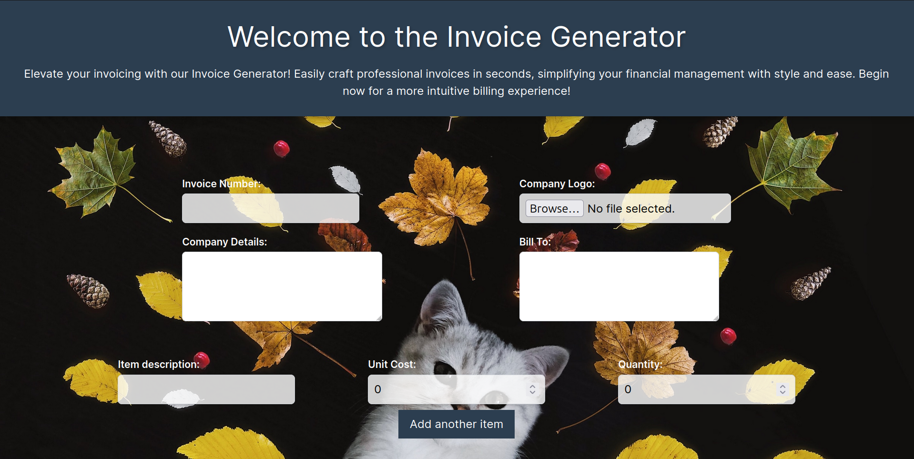
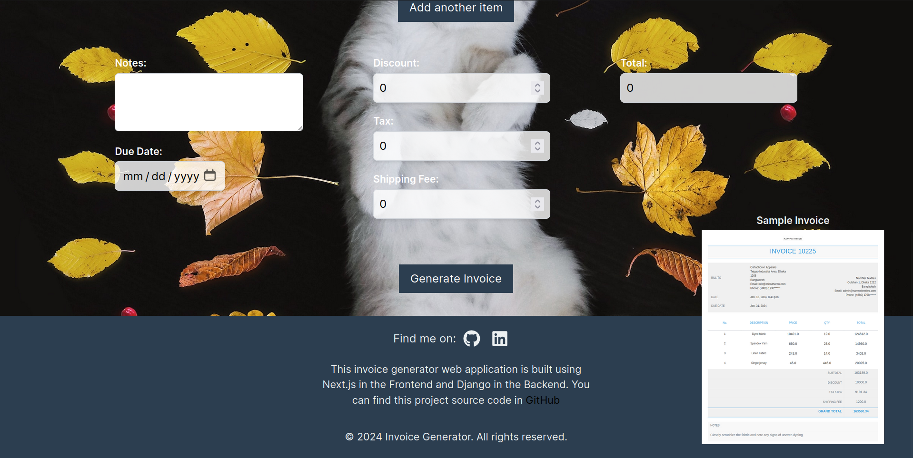
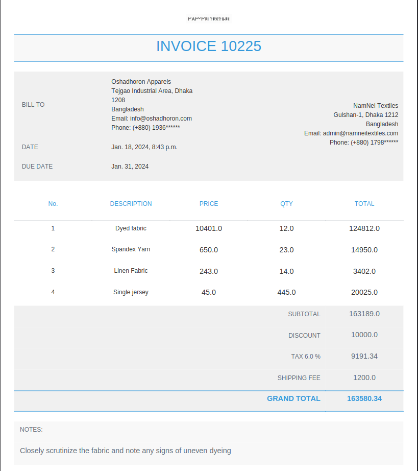

# Invoice Generator Web Application

Welcome to the Invoice Generator Web Application! This application allows users to effortlessly create and manage invoices with a user-friendly interface. The backend is powered by Django, while the frontend is built using Next.js.

## Screenshots

<<div align="center">





</div>

## Features

- **User-Friendly Interface**: The application provides an intuitive and easy-to-use interface for creating invoices.

- **Real-Time Preview**: Will be added soon.

- **Customizable Templates**: Will be added soon.

- **Export Options**: Easily export your invoices in PDF format.

## Technologies Used

- **Django**: A high-level Python web framework for building robust backend applications.

- **Next.js**: A React framework for building efficient and scalable frontend applications.

## Getting Started

Follow these steps to get the Invoice Generator Web Application up and running on your local machine.

### Prerequisites

- [Python](https://www.python.org/) installed on your machine
- [Node.js](https://nodejs.org/) installed on your machine
- [Git](https://git-scm.com/) for version control
- [PostgreSQL] (https://customer.elephantsql.com/instance/create) Create a PostgreSQL database instance

### Installation

1. Clone the repository:

   ```bash
   git clone https://github.com/your-username/invoice-generator.git
   ```

2. Change Database setting from settings.py file.

3. Navigate to the backend folder and install Python dependencies:
   ```bash
   cd backend/invoice
   pip install -r requirements.txt
   ```
4. Apply database migrations and runserver:
   ```bash
   python manage.py makemigrations
   python manage.py migrate
   python manage.py runserver
   ```
5. In a new terminal, navigate to the frontend folder and install Node.js dependencies:
   ```bash
   cd frontend
   npm install
   ```
6. Start the Next.js development server:
   ```bash
   npm run dev
   ```
7. Open your web browser and visit http://localhost:3000 to access the Invoice Generator.

## License

This project is licensed under the MIT License - see the LICENSE file for details.

I hope you enjoy using the Invoice Generator Web Application! If you have any questions or issues, please don't hesitate to open an issue.
